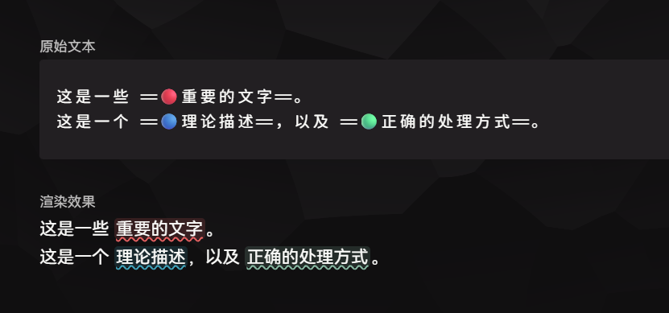
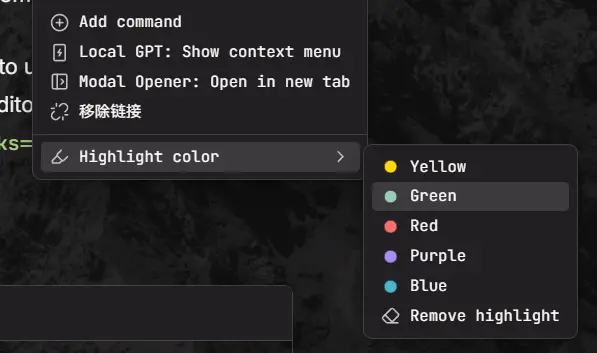
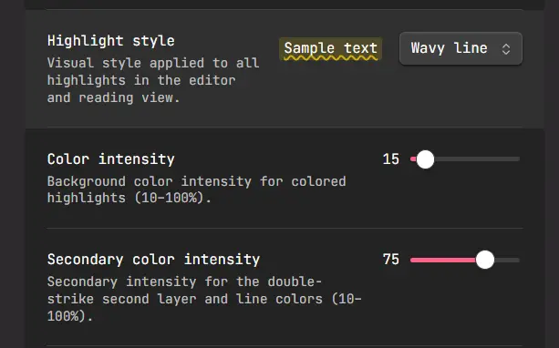
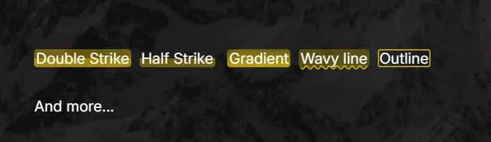
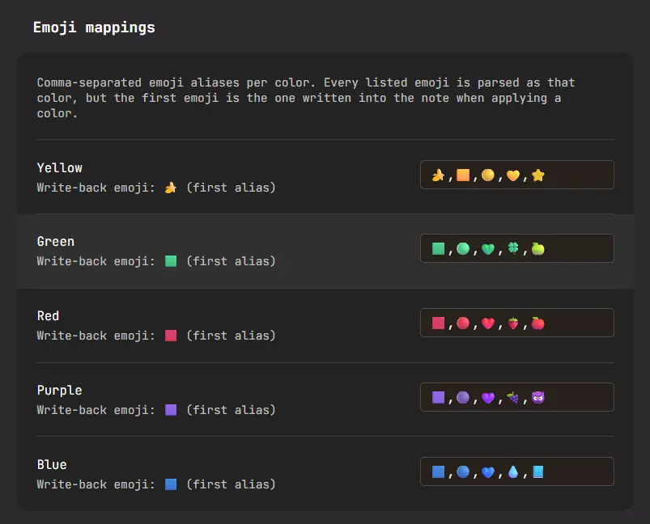

# Colorful Highlights（多彩高亮）

[](https://github.com/Moyf/colorful-highlights/releases) [](https://github.com/Moyf/colorful-highlights/releases) [](https://github.com/Moyf/colorful-highlights/stargazers) [](https://github.com/Moyf/colorful-highlights/blob/main/LICENSE) [](https://obsidian.md/plugins?id=colorful-highlights)

[English README](README.md)

想要在 Obsidian 内实现带有颜色的高亮划线吗？现在就能实现！
用 emoji 前缀即可为 Obsidian 的 `==高亮==` 着色。
像这样的文本： `==🔴重要内容==`，会自动渲染为红色高亮——emoji 默认隐藏，编辑时显现。




## 功能

- **Emoji 前缀自定义** —— 除了默认的 emoji 之外，你还可以将任意 emoji 映射到 5 个颜色槽位（黄 / 绿 / 红 / 紫 / 蓝），并可在设置中通过「拓展颜色」开关扩展到 10 个（灰 / 橙 / 青 / 紫红 / 白）。例如用 `🍎` 表示红色、`🍌` 表示黄色，均可读取显示。每个槽位的第一个 Emoji 是插件默认写入的 emoji。
- **实时预览与源码模式** —— 实时编辑模式只显示彩色高亮样式，光标进入高亮时才显示 emoji 字符（源码模式可选择保持可见）。
- **高亮样式** —— 提供多种高亮样式：默认、半填充、加深填充、下划线、波浪线、仅下划线、仅波浪线、圆角填充、描边、渐变填充。
- **默认高亮颜色** —— 无 emoji 的普通 `==文本==` 可映射到某个颜色槽位；切换为该颜色时不自动添加 emoji 前缀。
- **命令与右键菜单** —— 切换高亮、按颜色高亮、移除高亮。选中文字（或已有高亮）后右键即可看到颜色操作。



## 使用方法

1. 选中文字，在命令面板执行 **高亮为红色**（或任意颜色）—— 选中文本变为 `==🔴文本==`。
2. 再次执行其他颜色命令即可切换颜色；执行 **切换高亮** 取消高亮。
3. 也可以在选中文字后右键，在编辑器菜单的颜色操作中切换。
4. 或者直接手动输入语法：`==🔵任意 emoji 前缀都可以==`。

测试文本：
```md
这是一些 ==🔴重要的文字==。
这是一个 ==🔵理论描述==，以及 ==🟢正确的处理方式==。
```

## 样式
在设置中，可以选择不同的高亮样式


效果如图：



## 设置



| 设置项 | 说明 |
| ------ | ---- |
| 启用多彩高亮 | 解析与着色的总开关。 |
| 高亮样式 | 默认 / 半填充 / 加深填充 / 下划线 / 波浪线 / 仅下划线 / 仅波浪线 / 圆角填充 / 描边 / 渐变填充。 |
| 默认高亮颜色 | 普通 `==文本==` 的颜色；切换到此颜色会移除 emoji 前缀。 |
| 颜色强度 | 背景色混合百分比（10–100%）。 |
| 第二层颜色强度 | 「加深填充」的第二层，以及各种线条的颜色（10–100%）。 |
| 着色方式 | 「插件样式」由插件直接绘制背景；「主题原生」仅覆盖 `--text-highlight-bg` 变量，由主题绘制高亮。 |
| 编辑器 / 阅读视图着色 | 两个界面可独立开关。 |
| 拓展颜色 | 在命令、菜单和设置中显示额外的 5 个颜色槽位（灰 / 橙 / 青 / 紫红 / 白），默认关闭。 |
| 颜色 | 每个槽位的十六进制颜色。 |
| Emoji 映射 | 每个槽位的逗号分隔别名；第一个别名用于回写。 |


## 兼容性

- 支持桌面端和移动端。
- 需要 Obsidian 1.13.0 及以上版本。
- 仅本地解析与渲染 —— 不发起任何网络请求，数据不离开你的仓库。

## 致谢

emoji 高亮机制最初作为给 [Sidebar Highlights](https://github.com/trevware/obsidian-sidebar-highlights) 的 [PR #114](https://github.com/trevware/obsidian-sidebar-highlights/pull/114) 开发。现在将该功能抽取为独立插件。
两款插件可以共存：本插件负责编辑器与阅读视图的颜色渲染，Sidebar Highlights 负责高亮与评论的管理。

另外，`==🔴红色==` 的语法灵感来自 [Octarine](https://octarine.app/) 项目，非常感谢！

## Star History

[](https://www.star-history.com/#Moyf/colorful-highlights&Date)

## 许可证

MIT
