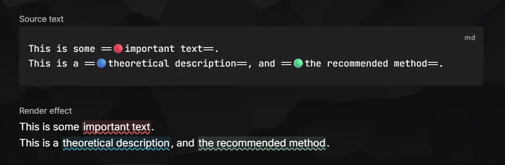

# Colorful Highlights

[](https://github.com/Moyf/colorful-highlights/releases) [](https://github.com/Moyf/colorful-highlights/releases) [](https://github.com/Moyf/colorful-highlights/stargazers) [](https://github.com/Moyf/colorful-highlights/blob/main/LICENSE) [](https://obsidian.md/plugins?id=colorful-highlights)

[简体中文](README-zh.md)

Want colored highlights in Obsidian? Colorize `==highlights==` with emoji prefixes. Text like `==🔴important content==` is rendered as a red highlight — the emoji is hidden by default and shown while editing.



## Features

- **Custom emoji prefixes** — map any emoji to 5 color slots (yellow / green / red / purple / blue), expandable to 10 (orange / cyan / magenta / gray / Black (Spoiler)) via the extended-colors toggle in settings. Each color can be shown or hidden independently. For example, `🍎` can represent red and `🍌` can represent yellow. The first emoji in each slot is used when writing highlights.
- **Live Preview & Source mode** — Live Preview shows only the colored highlight style; the emoji appears when the cursor enters the highlight. Source mode can optionally keep the emoji visible.
- **Highlight styles** — default, half-strike, double-strike, underline, wavy line, underline only, wavy line only, rounded, outline, and gradient.
- **Default highlight color** — plain `==text==` without an emoji can map to a color slot; switching to that color does not add an emoji prefix.
- **Commands & context menu** — toggle highlights, highlight with a specific color, or remove highlights. Select text (or an existing highlight) and right-click to access the color actions.


## Usage

1. Select text and run **Highlight with red** (or any color) from the command palette — the selection becomes `==🔴text==`.
2. Run another color command to switch colors; run **Toggle highlight** to remove the highlight.
3. Right-click selected text to find the same color actions in the editor menu.
4. Or type the syntax manually: `==🔵any emoji prefix works==`.

Example:

```md
This is some ==🔴important text==.
This is a ==🔵theoretical description==, and ==🟢the correct way to handle it==.
```

## Styles

Choose a highlight style in Settings:


Example results:


## Settings


| Setting | Description |
| ------- | ----------- |
| Enable colorful highlights | Master switch for parsing and decoration. |
| Highlight style | Default / half-strike / double-strike / underline / wavy line / underline only / wavy line only / rounded / outline / gradient. |
| Default highlight color | Color for plain `==text==`; switching to it removes the emoji prefix. |
| Color intensity | Background color mix percentage (10–100%). |
| Secondary color intensity | Second layer of double-strike and line colors (10–100%). |
| Color rendering | Plugin styles paint the background directly; theme native only overrides `--text-highlight-bg` and lets your theme paint highlights. |
| Decorate in editor / Reading view | Toggle each surface independently. |
| Extended colors | Reveal five extra color slots (orange / cyan / magenta / gray / Black (Spoiler)) in commands, menus, and settings. Off by default. |
| Colors | Choose a hex color for each regular slot; Black (Spoiler) uses a fixed text-colored cover. The toggle beside each color controls whether it appears in mappings, commands, menus, and rendering. |
| Emoji mappings | Comma-separated aliases for each shown slot; the first alias is used for write-back. |

## Compatibility

- Works on desktop and mobile (`isDesktopOnly: false`).
- Requires Obsidian 1.13.0+.
- Uses only local parsing and rendering — no network requests, no data leaves your vault.

## Credits

The emoji-highlight mechanism was originally built as [PR #114](https://github.com/trevware/obsidian-sidebar-highlights/pull/114) for [Sidebar Highlights](https://github.com/trevware/obsidian-sidebar-highlights). This plugin extracts that feature into a standalone package. If you also use Sidebar Highlights, the two plugins coexist: this one renders colors in the editor and Reading view, while the sidebar plugin manages highlights and comments.

The `==🔴red==` syntax was inspired by the [Octarine](https://octarine.app/) project.

## Star History

[](https://www.star-history.com/#Moyf/colorful-highlights&Date)

## License

MIT
